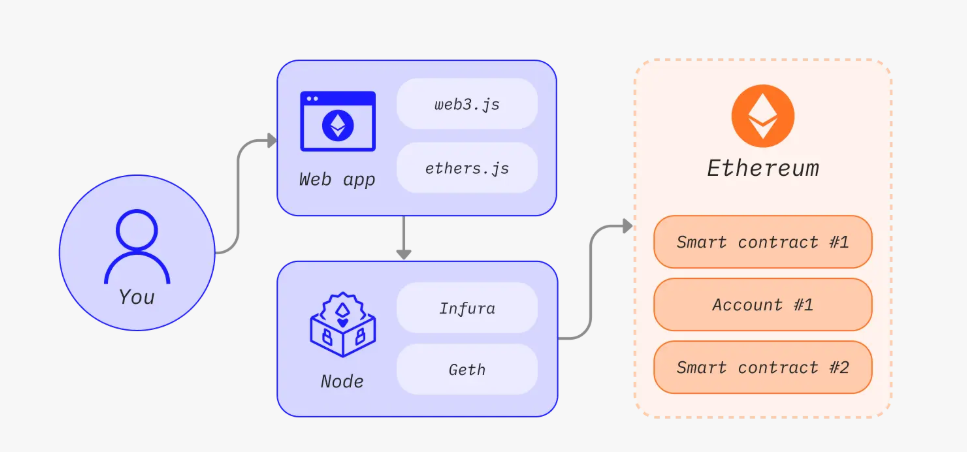
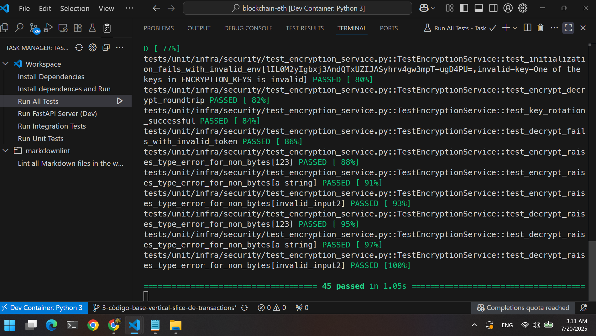
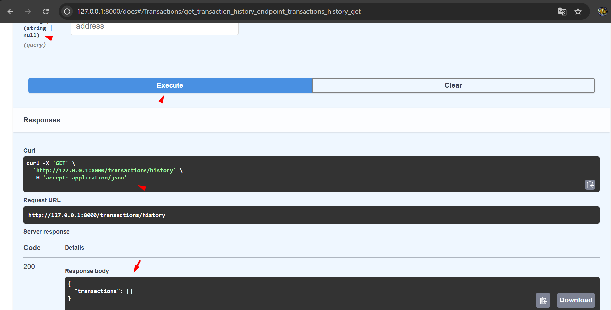

# Ethereum Interaction API

A secure API to interact with the Ethereum blockchain.

- Demonstrate knowledge and ability to interact securely with blockchain networks.
**Work in progress**

## Docs

[Knowledge based on my Miro Board](https://miro.com/app/board/uXjVJdxGUcs=/?share_link_id=124371910100)
[Infra doc WIP](./src/infra/INFRA_DOC.md)
[Core doc WIP](./src/core/CORE_DOC.md)

## Images

