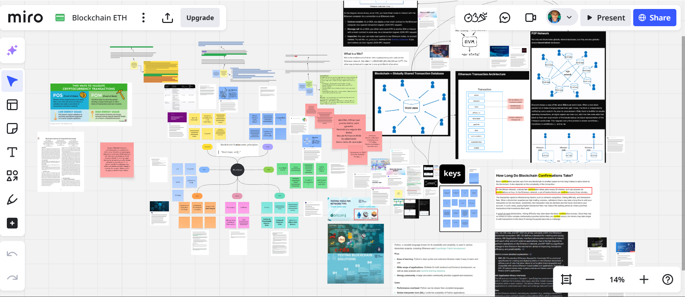
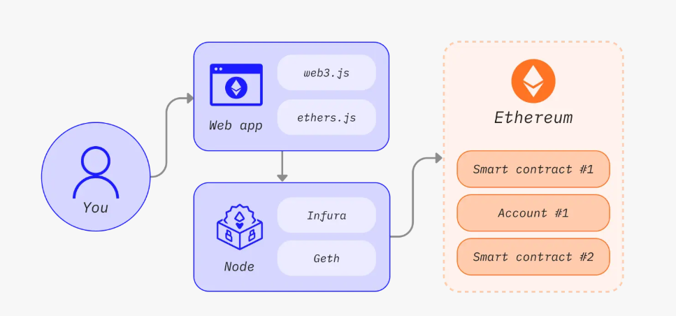
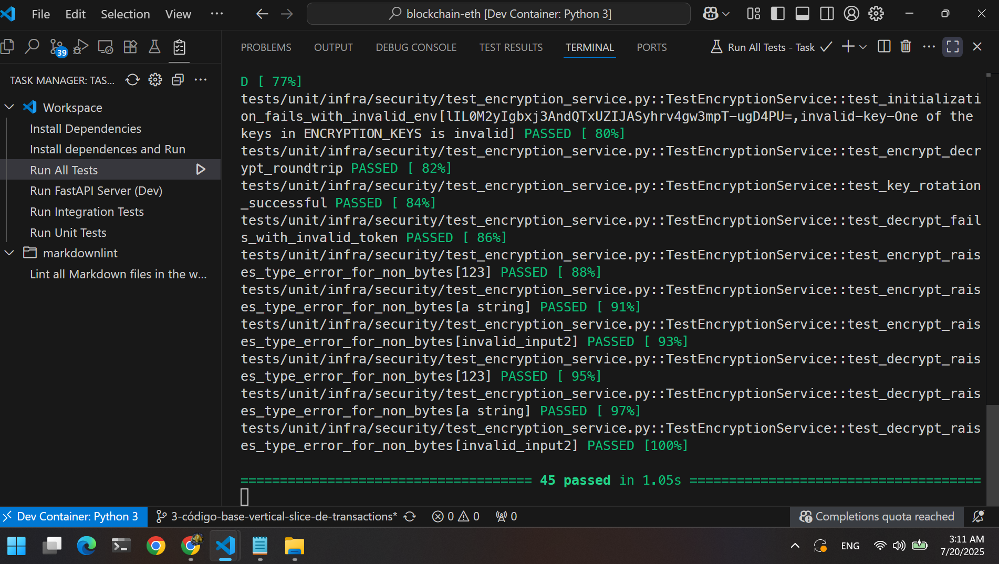

# Ethereum Interaction API

A secure API to interact with the Ethereum blockchain.

Demonstrate knowledge and ability to interact securely with blockchain networks.

- **Work In Progress:**
- [Next task](https://github.com/users/vlademirjunior/projects/3/views/1)

## Docs

- [Knowledge based on my Miro Board](https://miro.com/app/board/uXjVJdxGUcs=/?share_link_id=124371910100)
- [Infra doc WIP](./src/infra/README.md)
- [Core doc WIP](./src/core/README.md)

## Images






## Dev Container Ready

- Includes a pre-configured development container for a consistent, one-click setup with zero local dependencies required besides Docker.

### With Dev Containers (Recommended)

This is the easiest and most reliable way to run the project.

**Prerequisites:**

- Docker
- [Visual Studio Code](https://code.visualstudio.com/)
- [VS Code Dev Containers extension](https://marketplace.visualstudio.com/items?itemName=ms-vscode-remote.remote-containers)

**Steps:**

1. **Clone the Repository:**

    ```bash
    git clone git@github.com:vlademirjunior/blockchain-eth.git
    cd blockchain-eth.git
    ```

2. **Set Environment Variables:** Create a file named `.env` in the root of the project and add your API keys(copy from `.env-example`):

    ```env
    # .env
    DATABASE_URL=<DATABASE_URL>
    ENCRYPTION_KEYS=<NEWEST_ENCRYPTION_KEY>
    ETHEREUM_RPC_URL=<ETHEREUM_RPC_URL>
    CHAIN_ID=11155111
    MIN_CONFIRMATIONS=12
    ```

3. **Open in Dev Container:**
    - Open the project folder in VS Code.
    - A notification will appear asking to "Reopen in Container". Click it.
    - VS Code will build the python docker image to work in container.
