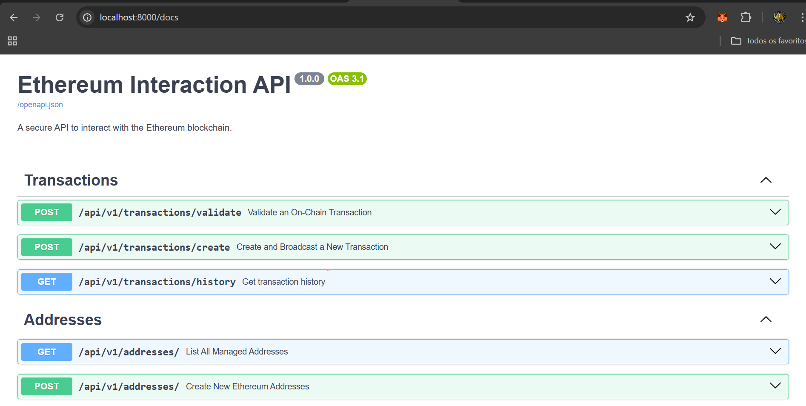
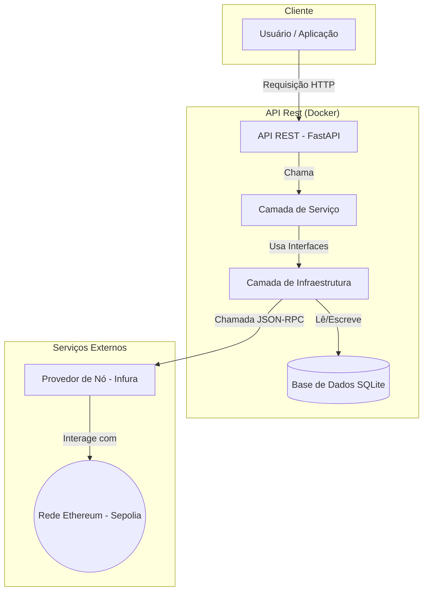

# Ethereum Interaction API

Uma API segura para interagir com a blockchain Ethereum, desenvolvida como uma demonstração de habilidades para interagir de forma segura com redes blockchain. **WIP**

[Fonte de conhecimento que permitiu desenvolver todo o projeto, clique aqui!](https://miro.com/app/board/uXjVJdxGUcs=/?moveToWidget=3458764634755076612&cot=10)



- Mais evidencias em `./images/`

## 1. Visão Geral do Projeto e Arquitetura

Este projeto é uma API RESTful robusta, construída em Python, que serve como uma ponte segura e eficiente para a blockchain Ethereum. A sua arquitetura foi meticulosamente desenhada para seguir as melhores práticas da engenharia de software, garantindo um código seguro, objetivo, testável e de fácil manutenção.

### Princípios e Padrões de Arquitetura

A base do projeto é a **Clean Architecture**, que promove uma separação clara de responsabilidades em três camadas distintas:

- **Domínio (`core`):** O coração da API, contendo a lógica de negócio pura e as entidades, sem dependências de frameworks ou tecnologias externas.
- **Infraestrutura (`infra`):** Contém os detalhes técnicos e a comunicação com o mundo exterior (blockchain, base de dados, serviços de criptografia).
- **Apresentação (`api`):** A camada mais externa, responsável por expor a funcionalidade através de uma API REST com FastAPI.

Esta estrutura é suportada por princípios e padrões de design sólidos:

- **SOLID:** Cada componente é desenhado para ser coeso e ter uma única responsabilidade.
- **Injeção de Dependência e Interfaces:** A comunicação entre as camadas é feita através de interfaces (contratos), permitindo que as implementações concretas sejam "injetadas" onde são necessárias. Isto desacopla o código e torna os testes unitários possíveis e eficientes.
- **Repository Pattern:** Abstrai a lógica de acesso a dados, permitindo que a camada de domínio trabalhe com os dados sem saber como ou onde eles são armazenados.
- **Singleton Pattern:** Usado para gerir o `NonceManager`, garantindo que existe apenas uma fonte da verdade para os nonces em toda a API, evitando condições de corrida(`Race condition`).
- **DRY (Don't Repeat Yourself) & YAGNI (You Ain't Gonna Need It):** O código é conciso, evitando repetições e focando-se estritamente nos requisitos do desafio.
- **Clean code:** O código é comentado apenas quando estritamente necessário para evitar ambiguidade ou facilitar o entendimento do desenvolvedor. Algumas variáveis como `transactions` são abreviadas para `tx` para manter a linguagem ubíqua do contexto de negócio do projeto.

### Boas Práticas

- **Tecnologia Assíncrona:** O uso correto de `asyncio` em toda a stack, desde o `FastAPI`, passando pelo `SQLAlchemy` assíncrono, até ao `web3.py` com `AsyncWeb3`, garante uma API de alta performance e não bloqueante.
- **Segurança Robusta:** A segurança é uma prioridade, demonstrada pela encriptação de chaves privadas com `MultiFernet` (que suporta rotação de chaves) e pela gestão segura de nonces para prevenir "`replay attacks`" e falhas em pedidos concorrentes`(Race condition)`.
- **Domínio da Blockchain:** A implementação vai além de simples chamadas. Ela inclui o cálculo de taxas EIP-1559 com margem de segurança, a validação de transações com base em confirmações, e a descodificação de interações com contratos ERC-20.
- **API RESTful e Idempotência:** A API segue os padrões REST, usando os verbos e códigos de status HTTP corretos. O endpoint `/validate` é idempotente, o que significa que chamá-lo múltiplas vezes com o mesmo input produz o mesmo resultado sem efeitos secundários indesejados.
- **Estratégia de Testes Profissional:** A arquitetura de testes, que separa rigorosamente **testes de unidade** (rápidos, isolados, com mocks) para a camada de domínio e **testes de integração** para a camada de infraestrutura (que interagem com uma base de dados em memória e um simulador de blockchain), é um pilar fundamental da qualidade do projeto.

---

## 2. Arquitetura e Fontes de entendimento

- **Base de Conhecimento:** [Diagrama no Miro com o estudo e planeamento do projeto](https://miro.com/app/board/uXjVJdxGUcs=/?share_link_id=124371910100)
- **Documentação da Infraestrutura durante Desenvolvimento:** [./src/infra/README.md](./src/infra/README.md)
- **Documentação do Domínio durante Desenvolvimento:** [./src/core/README.md](./src/core/README.md)

### Diagrama da Arquitetura

O diagrama abaixo ilustra o fluxo de comunicação da API, desde o cliente até à interação com a rede Ethereum através de um provedor de nós como o Infura.

[Clique aqui para interagir visualmente.](https://shorturl.at/yxTrG)



---

## 3. Como Executar o Projeto

Este projeto está pronto para ser executado num ambiente de desenvolvimento em container, garantindo uma configuração consistente e com um clique, sem necessidade de dependências locais para além do Docker e VSCode.

### Pré-requisitos

- Docker
- [Visual Studio Code](https://code.visualstudio.com/)
- [Extensão Dev Containers do VS Code](https://marketplace.visualstudio.com/items?itemName=ms-vscode-remote.remote-containers)

### Configuração do Ambiente

1. **Clonar o Repositório:**

    ```bash
    git clone git@github.com:vlademirjunior/blockchain-eth.git
    cd blockchain-eth
    ```

2. **Configurar Variáveis de Ambiente:**
    Crie um ficheiro `.env` a partir do exemplo `.env-example` e preencha as variáveis necessárias.

    ```bash
    cp .env-example .env
    ```

    O seu ficheiro `.env` deve parecer-se com isto:

    ```env
    # .env
    DATABASE_URL=sqlite+aiosqlite:///./local_database.db
    ENCRYPTION_KEYS=<SUA_CHAVE_DE_ENCRIPTACAO_AQUI>
    ETHEREUM_RPC_URL=<SUA_URL_RPC_DA_INFURA_AQUI>
    CHAIN_ID=11155111
    MIN_CONFIRMATIONS=12
    ```

    - Para gerar uma `ENCRYPTION_KEYS`, execute: `python src/generate_encryption_key.py`
    - Para obter uma `ETHEREUM_RPC_URL`, precisar fazer login na [plataforma](https://developer.metamask.io/) e gerar a sua clicando em `Create new API Kew`.

### Executar com Dev Containers (Recomendado)

1. Abra a pasta do projeto no VS Code.
2. Uma notificação irá aparecer a perguntar para "Reopen in Container". Clique nela.
3. O VS Code irá construir a imagem Docker e configurar o ambiente de desenvolvimento.
4. Quando estiver pronto, abra um terminal no VS Code (que já estará dentro do contentor) e inicie a API:

    ```bash
    uvicorn src.api.main:app --reload
    ```

    - Pode usar as tasks pre-definidas para iniciar com apenas um clique se quiser.

### Executar com Docker Compose

Se preferir usar `docker-compose`:

```bash
docker-compose up --build
```

---

## 4. Executar os Testes

O projeto tem uma suíte de testes completa que valida a lógica de negócio (testes unitários) e a interação com a infraestrutura (testes de integração).

### Via Linha de Comando

Para executar todos os testes (unitários e de integração), use o seguinte comando a partir da raiz do projeto:

```bash
python -m pytest -v
```

Para executar apenas os testes unitários (rápidos e sem I/O):

```bash
python -m pytest -v tests/unit
```

Para executar apenas os testes de integração (interagem com a base de dados em memória e o simulador de blockchain):

```bash
python -m pytest -v tests/integration
```

### Via VS Code Tasks

O projeto vem com tarefas pré-configuradas para facilitar a execução dos testes:

1. Abra a Paleta de Comandos (`Ctrl+Shift+P` ou `Cmd+Shift+P`).
2. Digite "Tasks: Run Task".
3. Escolha uma das opções:
    - **Run Unit Tests** (padrão)
    - **Run Integration Tests**
    - **Run All Tests**

---

## 5. Tutorial: Testar os Endpoints (Por exemplo)

Para testar os endpoints que interagem com a blockchain (`create`, `validate`), você vai precisar de um endereço com ETH de teste da rede Sepolia.

### Passo 1: Criar um Endereço na API

Primeiro, com a API rodando, use o endpoint `POST /addresses` para criar um novo endereço.

```bash
curl -X 'POST' \
  '[http://127.0.0.1:8000/api/v1/addresses/](http://127.0.0.1:8000/api/v1/addresses/)' \
  -H 'accept: application/json' \
  -H 'Content-Type: application/json' \
  -d '{"count": 1}'
```

**Resposta Esperada:**

```json
{
  "message": "Successfully created 1 new addresses.",
  "created_addresses": [
    {
      "public_address": "0xSeuNovoEnderecoAqui..."
    }
  ]
}
```

**Copie o `public_address` que você gerou.**

### Passo 2: Obter ETH de Teste num Faucet

Vamos usar um "faucet" que usa o seu computador para minerar uma pequena recompensa (No Browser).

1. **Abre o Faucet:** Vá para [**sepolia-faucet.pk910.de**](https://sepolia-faucet.pk910.de/#/).
2. **Cola o teu Endereço:** Cole o `public_address` que você copiou no passo 1.
3. **Começa a Minerar:** Clique em "Start Mining". Deixe a aba do navegador aberta. Você vai ver o seu "hashrate" a trabalhar.
4. **Pega a Recompensa:** Após alguns minutos, quando tiver minerado o suficiente, o botão "Claim Rewards" ficará ativo. Clique nele para receber o seu ETH de teste.

### Passo 3: Verificar o Saldo no Etherscan

1. **Abre o Etherscan:** Vá para [**sepolia.etherscan.io**](https://sepolia.etherscan.io/).
2. **Procura pelo teu Endereço:** Cole o seu `public_address` na barra de pesquisa.
3. **Confirma o Saldo:** Espere alguns momentos até que a transação do faucet seja confirmada e você veja o seu novo saldo de ETH na página.

### Passo 4: Testar os Endpoints de Transação

Agora que o seu endereço tem fundos, você pode testar a criação e validação de transações.

### Entender Possíveis Atrasos e Erros

Interagir com uma blockchain não é sempre instantâneo, como você pode ter aprendido comigo no meu Miro que deixei o link no topo.

- **Saldo Insuficiente (`insufficient funds`):** Se você tentar criar uma transação imediatamente após usar o faucet, pode receber este erro. Isto acontece porque o seu `node` (Infura) pode ainda não ter "confirmado" a sua transação. **Solução:** Espere `1-2 minutos` após `confirmar` o saldo `no Etherscan e tente novamente`.

- **Transação "Pendente/Stuck" (Mempool):** Quando você cria uma transação, ela entra numa "sala de espera" chamada **mempool**. Os `validadores` da rede `escolhem` as transações desta sala para incluir no próximo bloco, `geralmente priorizando as que pagam taxas mais altas`. Se a rede Sepolia estiver `congestionada`, a sua transação pode ficar pendente por alguns minutos.
  - Durante este tempo, o Etherscan e o seu endpoint `/validate` podem não encontrar o hash da transação, porque ela ainda não foi confirmada. **Solução:** Seja paciente e atualize a página do Etherscan após alguns minutos.

---

## 6. Princicpais Dependências do Projeto

- **FastAPI:** Framework web para construir a API.
- **Uvicorn:** Servidor ASGI para executar a API.
- **SQLAlchemy:** Toolkit SQL e ORM para interagir com a base de dados (com `aiosqlite` para suporte assíncrono).
- **Web3.py:** Biblioteca principal para interagir com a blockchain Ethereum.
- **Cryptography:** Usada para a encriptação segura das chaves privadas.
- **Pytest & Pytest-asyncio:** Para a suíte de testes unitários e de integração.
- **eth-tester:** Para simular uma blockchain em memória durante os testes.

---

## 7. Estrutura de Pastas (Macro view)

O projeto segue uma estrutura de Arquitetura Limpa para separar as responsabilidades e simples.

```txt
src/
├── api/                # Camada de Apresentação (Endpoints, Schemas, Dependências)
│   ├── endpoints/
│   └── main.py
├── core/               # Camada de Domínio (Entidades, Serviços, Interfaces)
│   ├── entities.py
│   ├── enums.py
│   ├── interfaces.py
│   └── services.py
└── infra/              # Camada de Infraestrutura (Detalhes Externos)
    ├── blockchain/     # Interação com Web3.py, NonceManager
    ├── database/       # Configuração do DB, Modelos, Repositórios
    └── security/       # Serviço de Criptografia
```

---

## 8. TODOs e Melhorias Futuras

Os seguintes pontos foram deixados como `TODO` no código e representam oportunidades de melhoria para uma API de produção:

- **`TODO` em `TransactionService` (Validação):**
  - **O quê:** "Para ERC-20, eu precisaria de buscar os decimais do token para converter de wei corretamente."
  - **Porquê:** Atualmente, a API assume que todos os tokens têm 18 decimais, como o ETH. Uma solução de produção precisaria de chamar a função `decimals()` do contrato do token para obter o valor correto (ex: 6 para USDC) e fazer a conversão de valor corretamente.

- **`TODO` em `Web3BlockchainService`:**
  - **O quê:** "Considerar uma forma mais robusta de gerir ABIs."
  - **Porquê:** Carregar um único ficheiro `erc20_abi.json` do disco é limitador. Uma solução de produção teria um sistema para gerir múltiplas ABIs, talvez guardando-as numa base de dados e buscando-as dinamicamente de um explorador de blocos (como o `Etherscan`) quando um novo contrato é encontrado.

- **`TODOs` em `**.py`:**
  - Refatorar código e melhorar a organização mas que não impactam na qualidade do projeto.

---

## 9. Como Contribuir (Conventional commits)

1. Faça um fork do projeto.
2. Crie uma nova branch (`git checkout -b feature/my-feature`).
3. Faça commit das suas alterações (`git commit -am 'feat: add new feature'`).
4. Faça push para a branch (`git push origin feature/my-feature`).
5. Abra um Pull Request.
6. Veja o ficheiro `CODE_OF_CONDUCT.md`

---

## 10. Licença

Este projeto está licenciado sob a Licença MIT. Veja o ficheiro `LICENSE` para mais detalhes.
